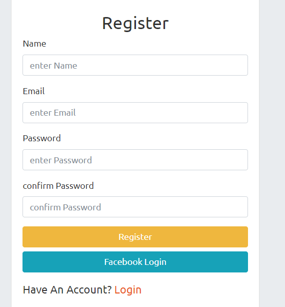

# Expense-Tracker

使用 Node.js & MySQL 設計的簡易 TODO LIST!
待辦事項輕鬆記~

## Features - 產品功能

<登入 & 註冊頁面>

1. 註冊 -> 使用者可以設定姓名、信箱、密碼
2. 登入 -> 使用者註冊成功後，可以登入
3. 點擊 Facebook login -> 使用者可以用 Facebook 帳號登入

<登入後頁面>

1. 首頁 -> 使用者可以瀏覽 TODO 清單
2. 點擊 Create 按鈕 -> 使用者可創造一筆新的 TODO 項目
3. 點擊 detail 按鈕 -> 使用者可瀏覽單一 TODO 項目
4. 點擊 edit 按鈕 -> 使用者可編輯單一 TODO 項目
5. 點擊 delete 按鈕 -> 使用者可刪除單一 TODO 項目
6. 點擊 Todo List(首頁左上角) -> 任何情況下點擊均會回到首頁
7. 點擊 Logout(首頁右上角) -> 任何情況下點擊均會登出，並回到 login 頁面

### 註冊頁

### 登入頁

### 首頁

### 新增支出頁面

### 修改頁面

## Installing - 專案安裝流程

1. 開啟終端機，執行以下指令 :

   > `git clone https://github.com/KarolChang/todo-sequelize.git`

2. 進入專案資料夾

   > `cd todo-sequelize`

3. 透過 npm 安裝套件

   > `npm install`

4. 安裝 nodemon

   > `npm install -g nodemon`

5. 使用腳本啟動專案

   新增種子資料 (需下載 [MySQL](https://dev.mysql.com/downloads/windows/installer/))

   > `npx sequelize db:seed:all`

   啟動專案

   > `npm run dev`

   > 在瀏覽器進入 http://localhost:3000

## Environment & Tools - 環境&使用工具

- [Visual Studio Code 編輯器](https://code.visualstudio.com/)
- [Node.js (v10.15.0)](https://nodejs.org/en/)
- [express 框架](https://www.npmjs.com/package/express)
- [express handlebars 模板引擎](https://www.npmjs.com/package/express-handlebars)
- [body-parser](https://www.npmjs.com/package/body-parser)
- [method-override](https://www.npmjs.com/package/method-override)

* [express-session](https://www.npmjs.com/package/express-session)
* [passport](https://www.npmjs.com/package/passport)
* [passport-local](https://www.npmjs.com/package/passport-local)
* [passport-facebook](https://www.npmjs.com/package/passport-facebook)
* [connect-flash](https://www.npmjs.com/package/connect-flash)
* [bcryptjs](https://www.npmjs.com/package/bcryptjs)
* [dotenv](https://www.npmjs.com/package/dotenv)

資料庫相關:

- [MySQL](https://dev.mysql.com/downloads/windows/installer/)
- [mysql2](https://www.npmjs.com/package/mysql2)
- [sequelize](https://www.npmjs.com/package/sequelize)
- [sequelize-cli](https://www.npmjs.com/package/sequelize-cli)
